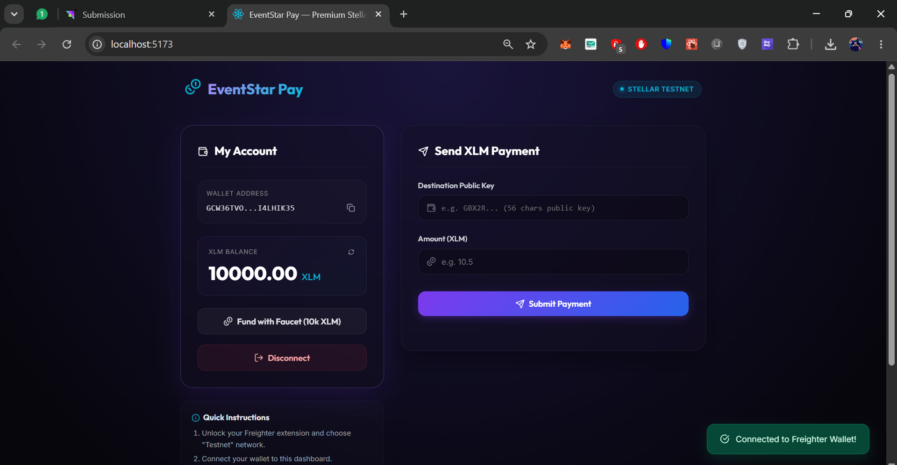
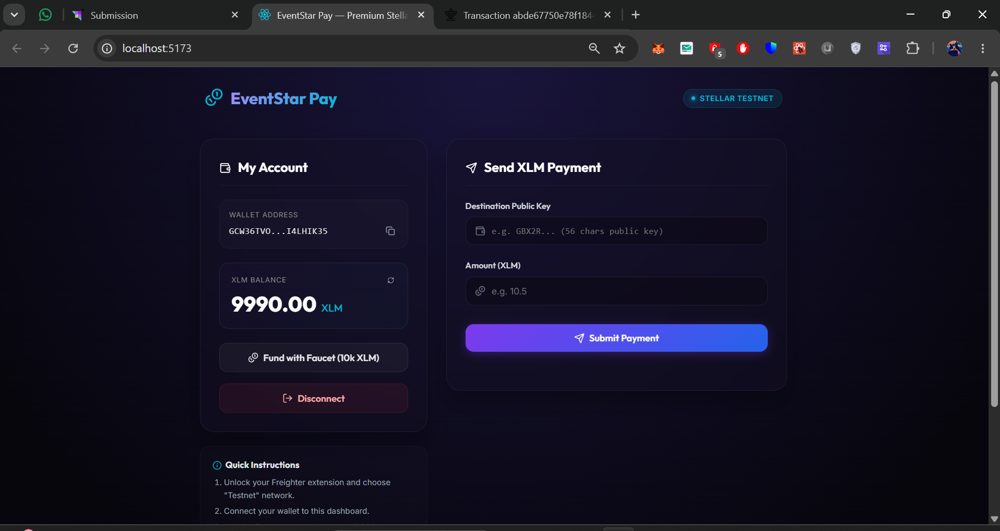
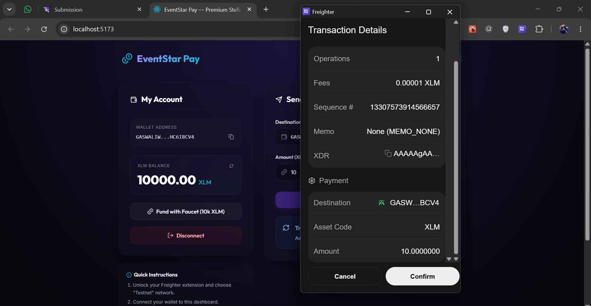
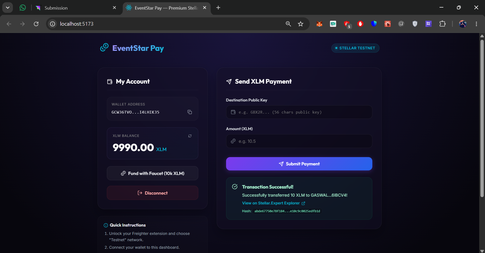

# EventStar Pay — Premium Stellar Testnet Portal 🌟

EventStar Pay is a highly polished, responsive, and secure Web3 decentralized application (dApp) built on the **Stellar Testnet**. It enables users to connect their Freighter browser wallet, check their XLM balances in real-time, instantly request testnet XLM via Friendbot faucet integration, and send fast transactions with comprehensive success/error feedback.

This project was built to satisfy all requirements of **Level 1 — White Belt Submission** of the Stellar developer pathway.

---

## 🚀 Key Features

*   **Wallet Integration**: Secure connect and disconnect bindings with the [Freighter Wallet](https://www.freighter.app/) extension.
*   **Balance Checker**: Live fetching and polling of native Lumens (XLM) from the Stellar Horizon Testnet API. Includes active error checking for uncreated/unfunded accounts.
*   **Built-in Testnet Faucet (Friendbot)**: Claim 10,000 testnet XLM with a single click right from the dashboard to easily test transactions.
*   **Payment Flow**: Seamlessly send XLM to any valid Stellar public key. Includes inputs for amount, destination wallet, active network validations, and transaction building.
*   **Real-time Transaction Feedback**: Informative status states during transaction construction, Freighter signature approval, and ledger submission, culminating in a transaction hash card with deep links to the `stellar.expert` block explorer.
*   **Rich Aesthetics**: Beautiful dark interface built with custom glassmorphism panels, glowing borders, smooth hover animations, and toast alerts.

---

## 🛠️ Technology Stack

*   **Framework**: [React 18](https://react.dev/) + [Vite](https://vite.dev/) (fast ESM-powered hot-reloading builder)
*   **Blockchain Communication**: [Official Stellar SDK (`@stellar/stellar-sdk`)](https://github.com/stellar/js-stellar-sdk)
*   **Browser Wallet Interface**: [Official Freighter API (`@stellar/freighter-api`)](https://docs.freighter.app/)
*   **Styling**: Premium Custom Vanilla CSS (no bloated UI packages, pure modern flex/grid and glassmorphic designs)
*   **Icons**: [Lucide React](https://lucide.dev/)

---

## 💻 Local Setup Instructions

Follow these steps to run the project locally on your machine:

### Prerequisites
1.  **Node.js**: Make sure you have Node.js (v18.0.0 or higher recommended) installed. You can check your version with:
    ```bash
    node -v
    ```
2.  **Freighter Wallet**: Install the [Freighter Extension](https://www.freighter.app/) in your browser.
    *   Open Freighter settings, go to **Network**, and make sure it is configured to **Testnet** (Default).
    *   Create or import an account to use on the testnet.

### Installation

1.  **Clone the Repository** (or navigate to your local directory):
    ```bash
    git clone https://github.com/anishkumar79/EventStar.git
    cd EventStar
    ```
    *(If running from the workspace folder directly, skip to step 2)*

2.  **Install NPM Dependencies**:
    ```bash
    npm install
    ```

3.  **Launch Local Development Server**:
    ```bash
    npm run dev
    ```
    This will launch the development server, usually at `http://localhost:5173`. Open this URL in your web browser.

4.  **Production Build** (Optional):
    To compile the optimized production bundle, run:
    ```bash
    npm run build
    ```

---

## 📸 Submission Screenshots

Below are screenshots showing the application states required for the White Belt submission.

### 1. Wallet Connected State
*Shows the dApp after successfully authorizing connection with Freighter, showing a shortened public key address and option to disconnect.*



---

### 2. Balance Displayed
*Shows the wallet's current XLM balance fetched directly from Horizon Testnet. If the account is new and unfunded, you can use the Faucet button to instantly load 10,000 XLM.*



---

### 3. Successful Testnet Transaction
*Shows the Freighter signing prompt and transaction approval window.*



---

### 4. Transaction Result Shown to User
*Shows the transaction success feedback panel on the dashboard containing the truncated transaction hash and explorer link.*



---

### 5. Stellar Explorer Verification
*Shows the transaction successfully confirmed and recorded on the Stellar Testnet ledger via the Stellar block explorer.*


